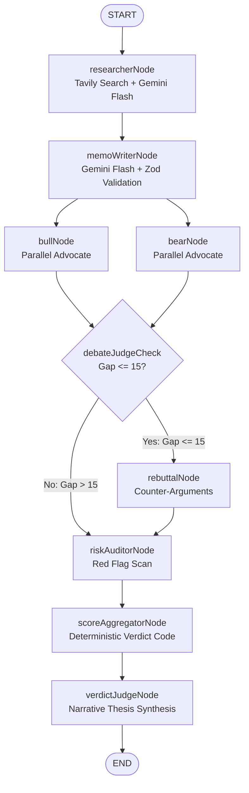

# The Deal Desk — AI Investment Committee Simulator

*Note on this README: This project was built using AI-assisted pair programming throughout. Rather than using generic templates, this documentation details the real engineering decisions, trade-offs, and pivots encountered during the build.*

---

## Overview

I built **The Deal Desk** to solve a common problem with LLMs in business workflows: unpredictability. When you ask a generic chatbot "Should we invest in Tesla?", you get a hallucination-prone, unstructured narrative. 

Instead of letting an LLM make the final call, The Deal Desk runs a structured, multi-agent committee process. The AI agents are restricted to extraction, advocacy (Bull vs. Bear), and risk scanning, while the final conviction score and verdict (**Invest / Watchlist / Pass**) are calculated deterministically in pure JavaScript code based on their outputs.

---

## How to run it

### Prerequisites
- Node.js (v18+)
- Google Gemini API Key (`GOOGLE_API_KEY`)
- Tavily Search API Key (`TAVILY_API_KEY`)

### Step 1: Configure Environment
Copy `.env.example` to `.env` at the root of the project:
```bash
cp .env.example .env
```
Fill in your API keys:
```env
GOOGLE_API_KEY=your_gemini_key
TAVILY_API_KEY=your_tavily_key
PORT=3001

# Optional: Neon or local Postgres connection URL for run history
DATABASE_URL=postgresql://neondb_owner:...
```
*Note: `DATABASE_URL` is optional. If left blank, the app will degrade gracefully, storing runs in memory for the active session without persistent history.*

### Step 2: Set Up Database (Optional)
If you provided a `DATABASE_URL`, run the schema migration to create the table:
```bash
cd backend
npm run db:migrate
```

### Step 3: Run the Application
You can start both the frontend and backend concurrently with a single command from the project root:
```bash
npm start
```
- **Frontend** will be running at [http://localhost:5173](http://localhost:5173)
- **Backend API** will be running at [http://localhost:3001](http://localhost:3001)

To run the multi-agent graph logic locally via command line to verify node execution traces, deterministic scoring logic, and retry behavior, run the test script:
```bash
cd backend
npm test
```

---

## How it works

The system is organized as a state machine using LangGraph.js:



### The Deterministic Decision Engine
Once the agents extract and advocate, they output structured parameters (using Zod schemas). The `scoreAggregatorNode` compiles these using a pure JS function:

1. **Market Position & Moat (25%)**: Evaluates competitive advantages and market share.
2. **Financial Health (25%)**: Scores margins, debt, revenue, and cash balances.
3. **Growth Trajectory (20%)**: Evaluates revenue growth rate and market expansion potential.
4. **Bear-Adjusted Conviction (15%)**: Computed by comparing the strength difference between the Bull and Bear advocates:
   $$\text{BearAdjusted} = \text{round}\left(\frac{(\text{BullStrength} - \text{BearStrength}) + 100}{2} \right)$$
5. **Source Quality (10%)**: Scaled based on the quantity of unique primary web sources retrieved (0-2 sources $\rightarrow$ $\le$40 points, 3-4 sources $\rightarrow$ $\le$70 points, 5+ sources $\rightarrow$ up to 100 points).

### Penalties, Caps, and Overrides
- **Risk Penalty**: High-severity risk flags reduce the final score (Medium: -8 points, High: -15 points).
- **Low-Data Confidence Cap**: If `lowDataConfidence === true` (less than 2 primary sources found), the conviction is strictly capped at **60**, preventing a high-conviction verdict on scarce evidence.
- **Critical Flag Override**: If the Risk Auditor detects a `critical` severity flag (e.g., active fraud or imminent bankruptcy), the verdict is immediately forced to **Pass** regardless of the calculated conviction score.

### Verdict Thresholds (Assuming no Critical Override)
- **Conviction $\ge$ 65** $\rightarrow$ **Invest**
- **45 $\le$ Conviction < 65** $\rightarrow$ **Watchlist**
- **Conviction < 45** $\rightarrow$ **Watchlist** (if a high-severity flag exists but conviction is $\ge$ 40) else **Pass**

---

## Key decisions & trade-offs

### 1. Handling Gemini Free-Tier Rate Limits
During development, running the Bull and Bear advocate agents in parallel frequently triggered `429 Resource Exhausted` rate-limit errors on the free-tier Gemini API. While using Pro models would exceed free quotas instantly and relying solely on a single model tier risked fragile workflows, I structured a fallback chain helper in [llm.service.js](backend/src/services/llm.service.js). Execution starts with `gemini-2.5-flash` for fast, structured extraction, but if a quota limit is met, the system seamlessly downgrades to `gemini-2.0-flash`, then to `gemini-1.5-flash`, paired with an exponential backoff retry delay ($2^n$ seconds).

### 2. Redesigning to the "Classified Case File" Theme
The initial design iteration was a generic, dark-themed AI landing page. I realized it lacked personality and looked identical to boilerplate templates. Instead of sticking with this conventional style, I completely pivoted the layout to a retro "Classified Investment Dossier" aesthetic. By utilizing warm manila folder tones, monospaced typewriter fonts, solid borders, rubber-stamp decals, and folder-tab progress bars, the user experience matches the multi-agent committee metaphor.

### 3. Additive Postgres History Layer
My original design relied entirely on an in-memory run store since the active real-time SSE streams did not require database operations. However, I noticed the job description highlighted database experience as a bonus. Rather than complicating the live streaming layer or making a database mandatory to run the basic application, I added an optional Postgres history layer. Completed runs write one record to the database, and the connection is safely wrapped in a try/catch: if `DATABASE_URL` is missing, the app logs a warning and degrades gracefully.

### 4. Resolving the "Blank Screen" SSE Connection Delay
Upon establishing the Server-Sent Events (SSE) stream, the page originally stayed empty for 30+ seconds while the first research node ran. I wanted to eliminate this blank state to keep the experience responsive. I updated [ProgressStepper.jsx](frontend/src/components/progress/ProgressStepper.jsx) to immediately trigger a dynamic "dossier initialization" log when the stream connects, and refactored the UI to render partial components (like verified source lists or the draft memo) in real-time as each graph node completes.

---

## Example runs

Real execution results are committed in the repository under the `docs/example-runs/` folder:
- [tesla_run.json](docs/example-runs/tesla_run.json) — **Pass Verdict (Conviction: 35/100)**: Underwent a full rebuttal round. Evaluated compressing gross margins (5.7% operating margins in Q4 2025) and regulatory headwinds, resulting in a Pass verdict due to high-severity flags.
- [paytm_run.json](docs/example-runs/paytm_run.json) — **Watchlist Verdict (Conviction: 58/100)**: Captures the recovery trajectory of the digital payments platform.

---

## What you would improve with more time

If I had more time, I would focus on three specific architectural improvements rather than padding the project with minor features:

1. **Portfolio Comparison Mode**: Currently, you load and view one target company at a time. I would expand the Postgres schema and UI to allow a grid view to compare multiple dossiers side-by-side, sorting them by conviction score and risk exposure.
2. **Cross-Source Fact Verification**: When the Tavily search extracts conflicting numbers (e.g., one blog post claims $15B revenue while a formal SEC source states $10B), the memo writer flags a generic `dataConflict: true` but doesn't resolve it. I would add a dedicated consensus node that cross-references source URLs against authority rankings to auto-resolve numerical discrepancies.
3. **Token-Level text streaming**: Right now, the UI receives updates at the node level (the entire memo or case arguments arrive at once). I would update the SSE emitter and LangGraph setup to support token-level streaming so the typewriter logs and memo text appear characters at a time as the LLM generates them.

---

## BONUS: LLM chat session transcript

Chat transcripts included separately in [docs/chat-logs/](docs/chat-logs/).
